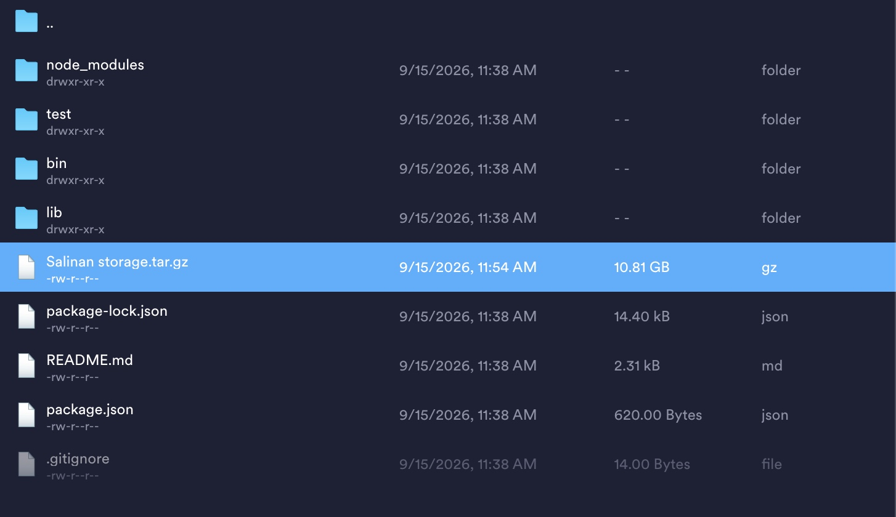

# gdown-js

[](#license)

Download files and folders from Google Drive, right from Node.js — no
browser, no OAuth app registration, no API key.

`gdown-js` is a Node.js package inspired by the Python
[`gdown`](https://github.com/wkentaro/gdown) by [@wkentaro](https://github.com/wkentaro).
It isn't a line-by-line port — Node handles HTTP, streams, and CLI parsing
differently from Python — but it aims for the same experience: paste a
share link, get your file, and don't get stuck on Drive's virus-scan warning
page for large files.



## Why

Google Drive shows an HTML "Google Drive can't scan this file for viruses"
interstitial for files it can't scan (usually anything large). A plain
`fetch`/`curl`/`axios` request against a share link just downloads that
HTML page instead of your file. `gdown-js` detects the interstitial and
automatically resubmits its hidden form fields — both the classic
`confirm=<token>` cookie style and the newer `uuid`-based form — to reach
the real file.

## Features

- Accepts a full share URL (`.../file/d/<id>/view`), a `uc?id=...` URL, an
  `open?id=...` URL, or a bare file ID.
- Automatically works around the large-file confirmation page.
- Streams straight to disk with a progress bar — never buffers the whole
  file in memory.
- Picks up the real filename from the `Content-Disposition` header when you
  don't pass `-O`.
- Experimental recursive folder download.
- Usable as a CLI (`gdown`) or as a library in your own Node scripts.

## Installation

This package isn't published to npm yet — install it from a local clone:

```bash
git clone https://github.com/tinoimammp/gdown-js.git
cd gdown-js
npm install
npm link   # optional: makes the `gdown` command available globally
```

## Usage

### Command line

Download a file:

```bash
gdown "https://drive.google.com/file/d/1AbCDeFGhIJKlmnop/view?usp=sharing"
```

By bare ID:

```bash
gdown 1AbCDeFGhIJKlmnop
```

Choose the output path:

```bash
gdown 1AbCDeFGhIJKlmnop -O myfile.zip
```

Suppress the progress bar and logs:

```bash
gdown 1AbCDeFGhIJKlmnop -q
```

Download a whole public folder (experimental):

```bash
gdown --folder "https://drive.google.com/drive/folders/1FoLdErIDxxxxxxxx" -O ./out
```

Run a long download in the background with `nohup` (keeps going after you
close the terminal/SSH session — use `-q` since there's no terminal to
render the progress bar to):

```bash
nohup gdown 1AbCDeFGhIJKlmnop -O myfile.zip -q > gdown.log 2>&1 &
```

Check on it later:

```bash
tail -f gdown.log      # follow progress/errors
jobs                    # see if it's still running (same shell session)
```

### As a library

```js
const { download, downloadFolder } = require('./lib/gdown');

await download('https://drive.google.com/file/d/1AbCDeFGhIJKlmnop/view', {
  output: 'myfile.zip',
});

await downloadFolder('1FoLdErIDxxxxxxxx', { output: './out' });
```

## Known limitations

Like upstream `gdown`, this only works against links that are publicly
viewable ("Anyone with the link") — there's no Drive API / OAuth flow here.

- **Folder download is best-effort.** Google doesn't publish a documented
  way to list a public folder's contents by scraping its page; this relies
  on an embedded JS variable (`_DRIVE_ivd`) whose format Google can change
  without notice.
- Not tested against live Google Drive in this environment (network access
  here is restricted to package registries); please test locally against a
  real file/folder link before relying on it.

## Acknowledgements

This project exists because of the reverse-engineering work done by
[@wkentaro](https://github.com/wkentaro) and contributors on the original
[`gdown`](https://github.com/wkentaro/gdown). If `gdown-js` is useful to
you, consider checking out (and supporting) the upstream project too.

## License

MIT
